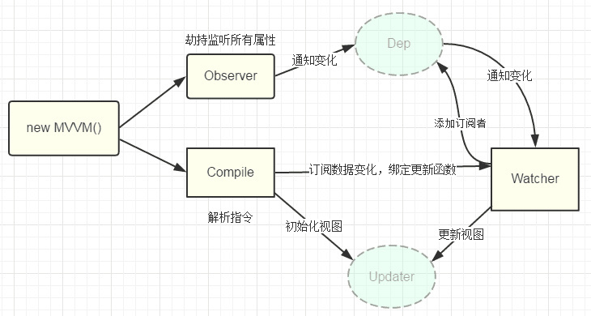

# MVVM

## 原理

数据劫持（`Object.defineProperty`） + 发布订阅模式（观察者模式）

**参考资料**：

- [面试题：你能写一个 Vue 的双向数据绑定吗？](https://segmentfault.com/a/1190000014274840)
- [不好意思！耽误你的十分钟，让 MVVM 原理还给你](https://juejin.im/post/5abdd6f6f265da23793c4458#heading-3)
- [模仿 Vue 写一个 mvvm](https://segmentfault.com/a/1190000015441785)
- [Vue.js 中的 MVVM](https://juejin.im/post/5b2f0769e51d45589f46949e)

## 数据劫持

vue 中使用 [`Object.defineProperty(object, key, descriptor)`](https://developer.mozilla.org/zh-CN/docs/Web/JavaScript/Reference/Global_Objects/Object/defineProperty) 来实现数据劫持，兼容性为 IE9+。

## 发布订阅模式
